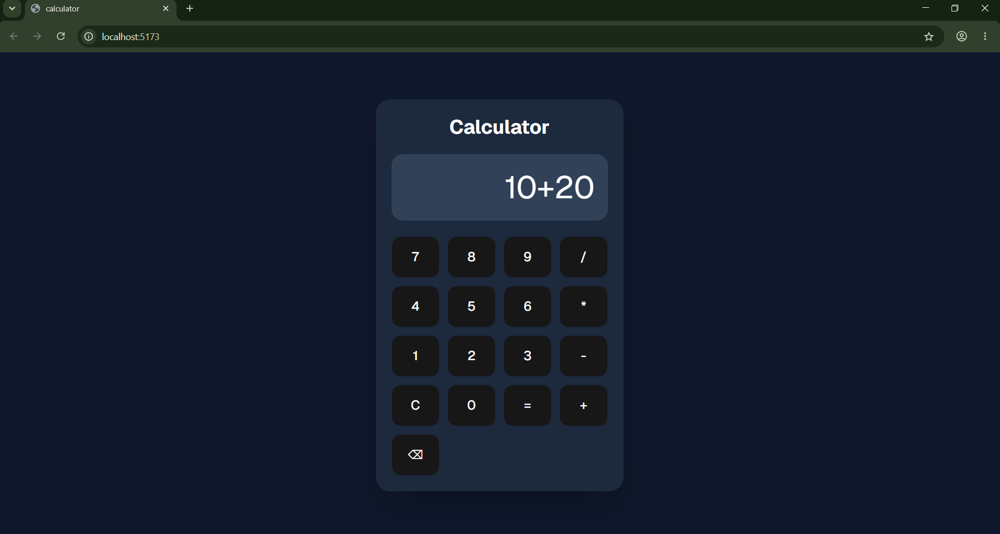

# Calculator App

A modern, responsive calculator built with React, Vite, and Tailwind CSS.

## Preview



## Features

- Basic arithmetic operations (addition, subtraction, multiplication, division)
- Clear and backspace functionality
- Error handling for invalid expressions
- Modern dark theme UI
- Responsive design
- Smooth user experience

## Tech Stack

- **React 19** - UI library
- **Vite** - Build tool and dev server
- **Tailwind CSS** - Styling
- **shadcn/ui** - UI components
- **Lucide React** - Icons
- **Geist Font** - Typography

## Installation

1. Clone the repository:
```bash
git clone <repository-url>
cd calculator
```

2. Install dependencies:
```bash
npm install
```

3. Run the development server:
```bash
npm run dev
```

4. Build for production:
```bash
npm run build
```

5. Preview production build:
```bash
npm run preview
```

## Usage

- Click on the number buttons to input numbers
- Use the operator buttons (+, -, ×, ÷) for calculations
- Press "=" to calculate the result
- Press "C" to clear the display
- Press "⌫" to delete the last character

## Project Structure

```
calculator/
├── public/
│   └── output.png          # Preview image
├── src/
│   ├── components/
│   │   ├── ButtonValue.jsx # Calculator buttons
│   │   └── Display.jsx     # Display component
│   ├── App.jsx             # Main app component
│   ├── index.css           # Global styles
│   └── main.jsx            # Entry point
├── package.json
└── vite.config.js
```

## License

This project is open source and available under the MIT License.
